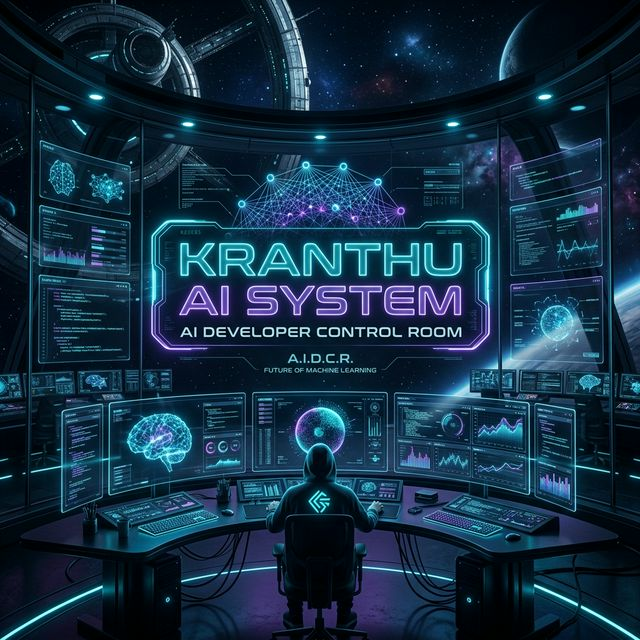

# 🌌 KRANTHU AI SYSTEM: The Control Room Portfolio



Welcome to the **Premium AI Developer Control Room**. This isn't just a portfolio; it's an immersive, cinematic experience designed to showcase high-end software engineering and AI capabilities.

---

## 🚀 Experience the Mainframe
**Live Demo:** [kskreddy2k7.github.io/kranthu-ai-portfolio/](https://kskreddy2k7.github.io/kranthu-ai-portfolio/)

> [!IMPORTANT]
> **Best experienced with sound enabled.** The system features a low-latency premium sound engine for a fully immersive "OS" feel.

---

## ✨ Cinematic Features

### 🖥️ OS-Themed Interface
- **Neural Boot Sequence:** An interactive initialization sequence with real-time system logs.
- **Glassmorphism UI:** Ultra-premium frosted glass panels with dynamic neon glow.
- **Magnetic Interaction:** Buttons and UI elements respond to your presence with subtle 2D and 3D movements.
- **Cyber-Cursor:** A custom glowing cursor with trailing effects (automatically disabled on mobile for native feel).

### 🔊 Premium Sound Engine
- **Tactile Feedback:** Low-latency Audio FX for clicks, hovers, and system notifications.
- **Cinematic Boot Chime:** A high-quality entry sound when the system is unlocked.
- **Brand-Level Control:** A persistent sound toggle next to the logo (persists across sessions).

### 🛠️ Advanced Project Showcase
- **3D Grid System:** Project cards featuring a real-time mouse-follow tilt effect.
- **GitHub Sync:** Dynamically pulls repository data via the GitHub REST API.
- **Category Matrix:** Real-time filtering across Web, AI, Apps, and Logic modules.

### 🤖 AI Neural Chatbot
- **System Assistant:** An integrated chatbot that knows everything about the developer's journey and skills.
- **Typing FX:** Realistic mechanical typing sounds synchronized with AI responses.

---

## 🛠 Tech Stack

| Layer | Technologies |
| :--- | :--- |
| **Frontend Core** | HTML5, Vanilla CSS3 (Custom Glassmorphism), JavaScript (ES6+) |
| **Interactions** | Bootstrap 5, FontAwesome 6, Typed.js, AOS |
| **System Logic** | Flask (Python), Context-Aware Audio Engine, Github REST API |
| **Styling** | Neon Gradients, Ultra-Refractive Glass Blur, Custom Typography |

---

## 📂 Project Architecture

```bash
kranthu-ai-portfolio/
├── app.py             # Flask System Gateway
├── export_static.py   # Production Static Exporter (for GitHub Pages)
├── templates/         # System Blueprints (Base & Index)
├── static/
│   ├── css/           # Neon Styling & Glass UI
│   ├── js/            # Neural Engine & Sound Manager
│   └── images/        # Cinematic Assets
└── index.html         # Final Production Build
```

---

## ⚡ Installation & Launch

### 1. Developer Mode (Flask)
Recommended for full AI Chatbot and dynamic functionality.
```bash
# Clone the system
git clone https://github.com/kskreddy2k7/kranthu-ai-portfolio.git

# Enter the mainframe
cd kranthu-ai-portfolio

# Initialize the server
python app.py
```
Open `http://localhost:5000`

### 2. Deployment Build (Static)
To regenerate the static `index.html` for GitHub Pages:
```bash
python export_static.py
```

---

## 🤝 Support the System
If you find the "Control Room" impressive, please give it a ⭐ on GitHub!

**Kata Sai Kranthu Reddy**
*AI Developer | Creative Technologist | Systems Architect*
